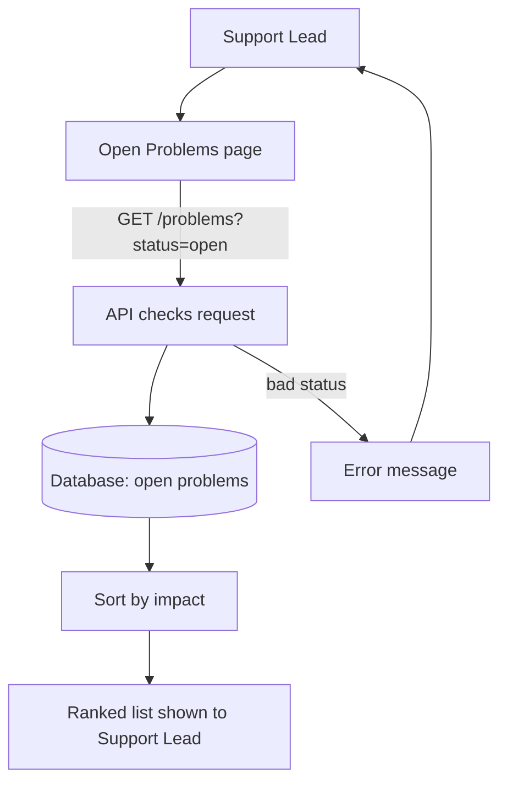

```mermaid
flowchart TD
A[Support Lead] --> B[Open Problems page]
B -->|GET /problems?status=open| C[API checks request]
C --> D[(Database: open problems)]
D --> F[Sort by impact]
F --> G[Ranked list shown to Support Lead]
C -->|bad status| E[Error message]
E --> A
```